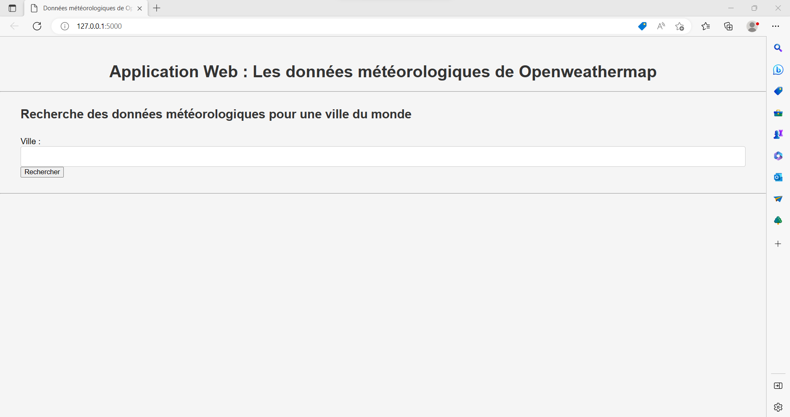
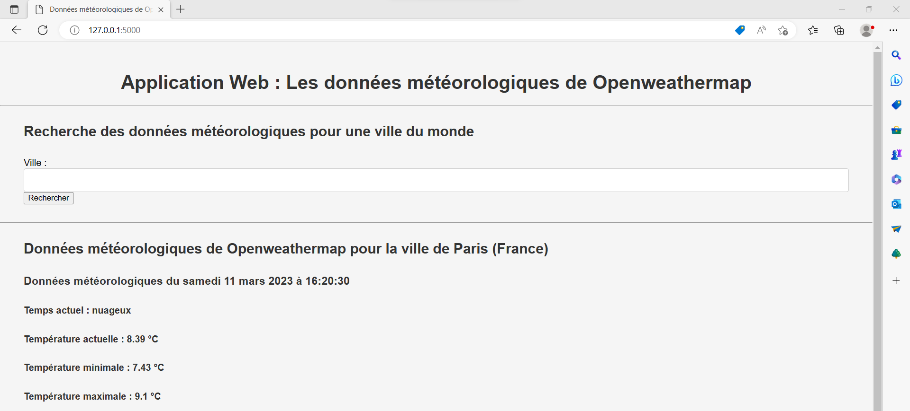

# Projet OpenWeatherMap API : Création d'une application Web avec Flask


## Introduction

### Description de OpenWeatherMap
OpenWeatherMap est une plateforme en ligne qui fournit des données météorologiques en temps réel et des prévisions météorologiques pour les entreprises et les particuliers du monde entier. Elle est basée sur une API (Application Programming Interface) qui permet aux développeurs d'intégrer les données météorologiques dans leurs applications.

La plateforme OpenWeatherMap collecte des données de plus de 40 000 stations météorologiques dans le monde entier, ainsi que des données satellites et radar. Elle fournit des informations telles que la température, la pression atmosphérique, l'humidité, la vitesse et la direction du vent, la couverture nuageuse, les précipitations, la qualité de l'air et bien plus encore.

OpenWeatherMap offre des abonnements payants pour les entreprises qui ont besoin de données météorologiques en temps réel et des prévisions météorologiques pour des régions spécifiques, ainsi que des plans gratuits pour les développeurs et les utilisateurs occasionnels.

OpenWeatherMap est utilisé par de nombreuses entreprises et organisations dans le monde entier, notamment les entreprises de l'industrie de l'énergie, de l'aviation, de la logistique, de l'agriculture, du tourisme et des loisirs.


### Description du Projet
Le projet consiste à créer une application web qui permet aux utilisateurs d'entrer le nom d'une ville dans le monde et de récupérer les données météorologiques associées à cette ville à partir de l'API OpenWeatherMap. Le projet est développé en utilisant le langage de programmation Python et le framework Flask pour la création d'applications web.

L'application se compose de deux parties : une partie d'accueil et d'un moteur de recherche pour obtnir des informations météorologiques. L'application web contient un formulaire qui permet aux utilisateurs d'entrer le nom d'une ville. Lorsque l'utilisateur soumet le formulaire, l'application récupère les données météorologiques pour cette ville à partir de l'API OpenWeatherMap en utilisant la clé API de l'utilisateur, puis affiche les données météorologiques sur la page d'informations météorologiques. Si le nom de la ville entré par l'utilisateur est incorrect, l'application affiche une page d'erreur informant l'utilisateur que la ville n'a pas été trouvée.

Le projet est organisé en plusieurs fichiers, chacun ayant une responsabilité spécifique. Le fichier "config.py" contient la clé API de l'utilisateur pour accéder à l'API OpenWeatherMap. Le fichier "weather.py" gère les requêtes API et récupère les données météorologiques pour une ville donnée. Le fichier "app.py" crée l'application Flask et définit les routes de l'application. Les fichiers HTML sont stockés dans le dossier "templates" et permettent de créer les pages web de l'application. Le fichier CSS est stocké dans le dossier "static" et permet de personnaliser l'apparence de la page we. Le fichier "requirements.txt" contient la liste des packages Python nécessaires pour exécuter l'application. Le fichier "country.py" contient un dictionnaires qui permettent de récupérer le nom du pays complet à partir de son code ISO 3166-1 alpha-2. Le ficchier "traduction.py" permet de traduire les données météorologiques en français. Le fichier "README.md" contient les informations sur le projet et les instructions pour l'exécuter.


## Information du projet

- Contributeur du projet : Antonin
- Date de la dernière mise à jour : 11 mars 2023


## Installation

### Prérequis du projet
- Création d'un compte sur le sur site [site web d'OpenWeatherMap](https://openweathermap.org/) afin d'obtenir la clé d'API pour accéder à l'API de OpenWeatherMap.
- [Python](https://www.python.org/downloads/)
- [flask](https://pypi.org/project/Flask/)
- Librairie python : requests


### Obtenir une clé API d'OpenWeatherMap
- Allez sur le [site web d'OpenWeatherMap](https://openweathermap.org/).
- Cliquez sur le bouton "Sign Up" en haut à droite de la page.
- Remplissez le formulaire d'inscription avec votre nom, votre adresse e-mail et votre mot de passe.
- Cochez la case "I agree to the Terms of Service" pour accepter les conditions d'utilisation.
- Cliquez sur le bouton "Create Account" pour créer votre compte.
- Après avoir créé votre compte, vous serez redirigé vers votre page de profil. Cliquez sur "API Keys" dans le menu de gauche.
- Cliquez sur le bouton "Generate" pour générer une nouvelle clé API.
- Copiez la clé API générée et conservez-la en lieu sûr.
Une fois que vous avez obtenu votre clé API, vous pouvez l'utiliser dans votre application pour accéder aux données météorologiques à partir de l'API OpenWeatherMap.

### Projet sur Git
Le projet est disponible sur le site [Github](https://github.com/) sur le lien : [https://github.com/antoningr/API_OpenWeatherMap](https://github.com/antoningr/API_OpenWeatherMap). 


### Téléchargement du projet
- Ouvrez votre terminal ou invite de commandes.
- Allez dans le répertoire où vous souhaitez enregistrer le projet.
- Tapez la commande suivante pour cloner le projet depuis le dépôt Git :
```
git clone https://github.com/antoningr/API_OpenWeatherMap.git
```
- Appuyez sur "Entrée" pour lancer la commande. Git va alors télécharger le projet dans le répertoire actuel.


### Packages python du projet
Avant d'exécuter le projet, il faut s'assurer d'avoir tous les packages python soit correctement installé avec les bonnes versions pour pouvoir exécuter cette application. 
- Ouvrez votre terminal ou invite de commandes.
- Accédez au répertoire du projet à l'aide de la commande cd.
- Installez les packages et les dépendances Python répertoriés dans le fichier requirements.txt, utilisez la commande suivante :
```
pip install -r requirements.txt
```
- Une fois l'installation terminée, vous pouvez exécuter le projet.

### Configuration du fichier config.py du projet
Modifier le fichier de configuration config.py dans le répertoire principal du projet et ajoutez-y votre clé d'API de OpenWeatherMap.
Voici un exemple de configuration :
```
# Clé API pour accéder à l'API de OpenWeatherMap à remplir
API_KEY = "sJFjHbJ7jjK97jpjdUJvFN8ndpYH5ubnGDhdYOdpo"
```

### Exécution de l'application
Après que le projet soit correctement installée avec tous les paquets et dépendances nécessaires, vous pouvez suivre ces instructions pour l'exécuter l'application web :
- Ouvrez une invite de commande ou une fenêtre de terminal.
- Naviguez vers le répertoire racine de l'application où se trouve le fichier app.py.
- Exécutez la commande suivante pour démarrer l'application web :
```
python app.py
```
- Si l'application démarre correctement, vous devriez voir une sortie similaire à celle qui suit :
```
* Exécution sur http://127.0.0.1:5000/ (Appuyez sur CTRL+C pour quitter)
```
- Ouvrez un navigateur Web, l'application web est accessible à l'adresse [http://127.0.0.1:5000](http://127.0.0.1:5000).
- L'application web devrait maintenant fonctionner et être accessible via un navigateur Web.


### Utilisation de l'application

À partir d'un navigateur Web, l'application web est accessible à l'adresse [http://127.0.0.1:5000](http://127.0.0.1:5000).
L'utilisateur peut maintenant à n'importe quelles données météorologiques d'une ville.


## Fonctionnalité de l'application web

L'application web permet de récupérer les données météorologiques d'une ville. L'utilisateur peut rechercher une ville et obtenir les données météorologiques de cette ville. L'application web à le design suivant :




#### Exemple de requête pour la ville de Paris (France) :
En recherchant la ville de Paris dans la barre de recherche, l'utilisateur obtient les données météorologiques de la ville de Paris (France). L'application web affiche les données météorologiques suivantes :
```
Données météorologiques de Openweathermap pour la ville de Paris (France)
Données météorologiques du samedi 11 mars 2023 à 16:20:30
Temps actuel : nuageux
Température actuelle : 8.39 °C
Température minimale : 7.43 °C
Température maximale : 9.1 °C
Pression atmosphérique : 1010 hPa
Humidité dans l'air : 62 %
Vitesse du vent : 3.09 m/s
Direction du vent : 150 °
Visibilité : 10000 m
```

